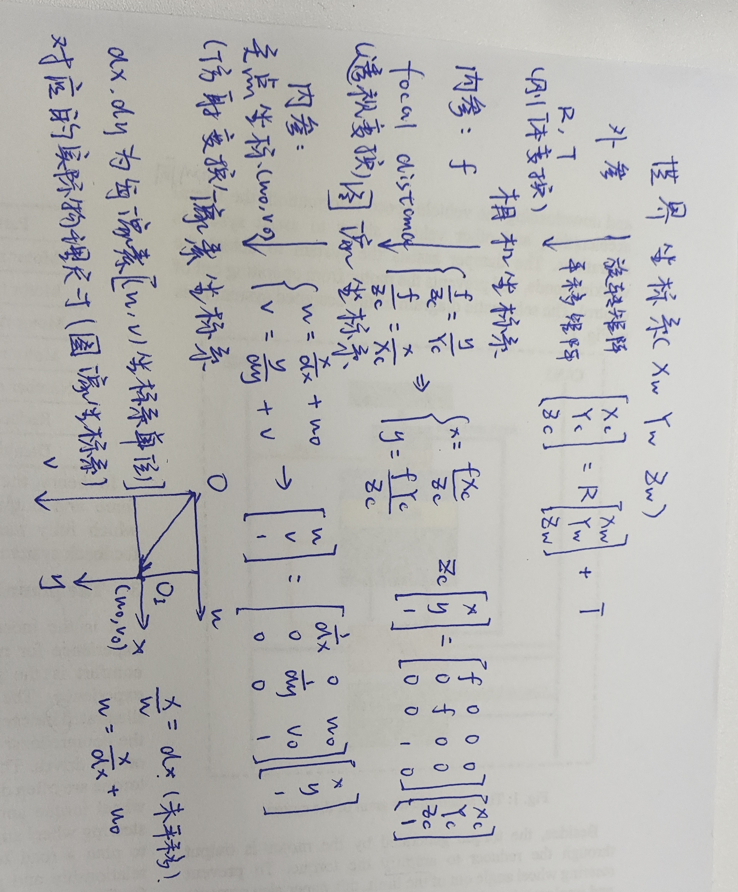

# CaLibrantion

## Define:

Camera calibration is the process of determining the intrinsic and extrinsic parameters of a camera. In simple terms, 
the process is to translating points from 2D image coordinates system to 3D world coordinates system.

And there are normally 4 coordinates in calibration: **world coordinate system**, **camera coordinate system**, **image coordinate system** and **Pixel coordinate system**. And here are 3 typically proceeds in camera calibration:

- World coordinate system to camera Coordinate System
- Camera Coordinate System to Image Coordinate System
- Image Coordinate System to Pixel Coordinate System

### Difine of Doordinate Dystems 

1. **世界坐标系**：
描述物体在真实世界与摄像头的位置关系，也称为测量坐标系。世界坐标系是整个场景或世界中所有物体的参考坐标系，它是一个全局坐标系，与相机位置和方向无关，通常由场景的固定参考点确定。以车辆为例，世界坐标系的远点通常是车辆质心，以垂直于车辆中心中的车辆运行方向作为X轴，横轴则作为Y轴，垂直于车辆的为Z轴。
2. **相机坐标系**：
相机坐标系是相机自身的坐标系，原点通常位于相机的光学中心，在相机坐标系中以相机镜头光心O_c作为相机坐标系的原点,以与相平面平行的两侧为X_c轴和Y_c轴,以与相机镜头光轴重合的为Z_c轴。
3. **图像坐标系(oxy)**：
在图像坐标系oxy中,原点为相机光轴和相平面的交点o,x轴和y轴相互垂直,主要用于表示相机内部成像平面,图像坐标系和像素坐标系之间为平移加缩放关系。 
4. **像素坐标系**：
在像素坐标系ouv中,原点为图片的左上角o处,u轴为水平坐标轴,v轴为(ouv) 垂直坐标轴。之所以需要建立像素坐标系是为了方便计算机处理图像,一般将数字图像以数组形式存储在计算机中、

### Transform of Doordinate Dystems 
如下图（不想找网图了。）

综合上述公式可以得到从世界坐标系到像素坐标系的转换关系式：

`R3*3 `&`T3*1`分别是旋转矩阵和平移矩阵